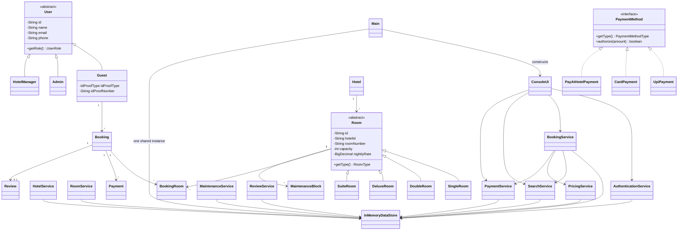

# Class diagram

```mermaid
classDiagram
    class Main
    class ConsoleUI
    class InMemoryDataStore
    class AuthenticationService
    class HotelService
    class RoomService
    class SearchService
    class PricingService
    class BookingService
    class PaymentService
    class MaintenanceService
    class ReviewService
    class User {
        <<abstract>>
        -String id
        -String name
        -String email
        -String phone
        +getRole()* UserRole
    }
    class Guest {
        -IdProofType idProofType
        -String idProofNumber
    }
    class Admin
    class HotelManager
    class Hotel
    class Room {
        <<abstract>>
        -String id
        -String hotelId
        -String roomNumber
        -int capacity
        -BigDecimal nightlyRate
        +getType()* RoomType
    }
    class SingleRoom
    class DoubleRoom
    class DeluxeRoom
    class SuiteRoom
    class Booking
    class BookingRoom
    class Payment
    class Review
    class MaintenanceBlock
    class PaymentMethod {
        <<interface>>
        +getType() PaymentMethodType
        +authorize(amount) boolean
    }
    class UpiPayment
    class CardPayment
    class PayAtHotelPayment

    Main --> ConsoleUI : constructs
    Main --> InMemoryDataStore : one shared instance
    ConsoleUI --> AuthenticationService
    ConsoleUI --> BookingService
    ConsoleUI --> SearchService
    ConsoleUI --> PaymentService
    AuthenticationService --> InMemoryDataStore
    HotelService --> InMemoryDataStore
    RoomService --> InMemoryDataStore
    SearchService --> InMemoryDataStore
    PricingService --> InMemoryDataStore
    BookingService --> InMemoryDataStore
    BookingService --> SearchService
    BookingService --> PricingService
    BookingService --> PaymentService
    PaymentService --> InMemoryDataStore
    MaintenanceService --> InMemoryDataStore
    ReviewService --> InMemoryDataStore
    User <|-- Guest
    User <|-- Admin
    User <|-- HotelManager
    Room <|-- SingleRoom
    Room <|-- DoubleRoom
    Room <|-- DeluxeRoom
    Room <|-- SuiteRoom
    PaymentMethod <|.. UpiPayment
    PaymentMethod <|.. CardPayment
    PaymentMethod <|.. PayAtHotelPayment
    Hotel "1" --> "*" Room
    Guest "1" --> "*" Booking
    Booking "1" --> "*" BookingRoom
    Room "1" --> "*" BookingRoom
    Booking "1" --> "*" Payment
    Room "1" --> "*" MaintenanceBlock
    Booking "1" --> "0..1" Review
```
